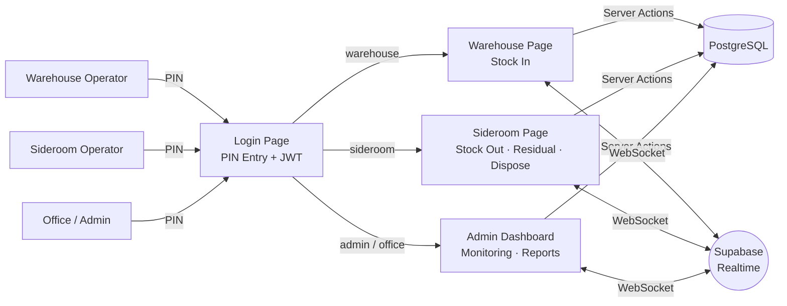
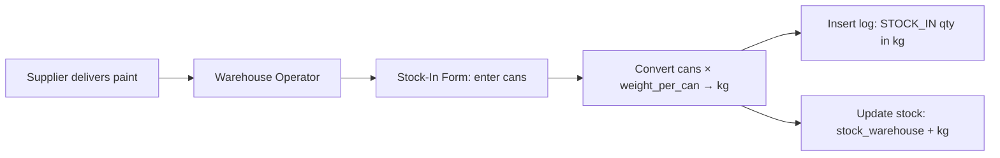
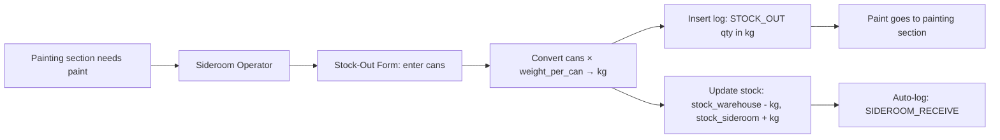
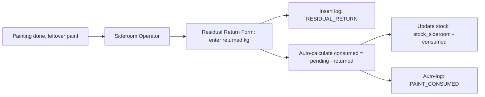
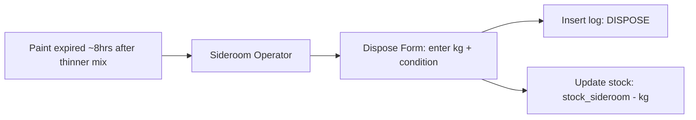

# System Architecture

## Overview

A web-based paint stock management system for a factory. The system digitizes the manual stock card process and provides real-time monitoring for the office.

## Tech Stack

| Layer | Technology |
|-------|-----------|
| Frontend | Next.js 16 (App Router), TypeScript |
| UI | Tailwind CSS v4, shadcn/ui |
| Charts | Recharts |
| Backend | Supabase (PostgreSQL, Realtime) |
| Auth | Custom JWT (jose) + bcrypt PIN hashing |
| Deployment | Cloudflare Workers (via OpenNext.js), Supabase (backend) |

## System Architecture Diagram



## Operator Responsibilities

| Role | Page | Operations |
|------|------|------------|
| `warehouse` | `/warehouse` | **Stock In** only (receiving new paint into warehouse) |
| `sideroom` | `/sideroom` | **Stock Out** (take from warehouse), **Residual Return** (record leftover), **Dispose** (expired paint) |
| `admin` | `/dashboard`, `/admin/*` | Full access: dashboard, reports, manage master data |
| `office` | `/dashboard` | Dashboard access for monitoring and reports (read-only) |

> **Note**: Stock Out is handled by the **sideroom operator** (not warehouse), because the sideroom operator both takes paint out of the warehouse and later reconciles the residual from painting.

## Data Flow

> All stock is tracked in **kg**. On stock-in/out the operator enters cans; the
> app converts to kg via `paint_items.weight_per_can` before writing `log.qty`
> and stock columns. Sideroom operations (residual return, dispose) are entered directly in kg.

### Stock-In (New Paint Arrives)



### Stock-Out (Warehouse to Sideroom)



### Residual Return (Leftover Paint from Painting)



### Dispose (Expired Paint)



## Authentication Flow

All users log in with a PIN (4 digits). No Supabase Auth — just a simple lookup with bcrypt support:

1. User enters PIN on login page
2. Server fetches all users and compares PINs in-memory (supports bcrypt-hashed and legacy plaintext)
3. Legacy plaintext PINs are auto-hashed on successful login
4. Rate limiting: 10 attempts per 15-minute window
5. If matched, a JWT session cookie is created (signed with `jose`, 8-hour expiry)
6. User is redirected to their role-specific dashboard:
   - `warehouse` → `/warehouse`
   - `sideroom` → `/sideroom`
   - `admin` → `/dashboard`
   - `office` → `/dashboard`

## Route Protection

| Route | Access |
|-------|--------|
| `/login` | Public (redirects to dashboard if already logged in) |
| `/warehouse/**` | Authenticated users only |
| `/sideroom/**` | Authenticated users only |
| `/dashboard/**` | Authenticated users only |
| `/admin/**` | Authenticated users only |

Server-side route protection is centralized in `src/lib/auth-guard.ts` via the `requireRole()` helper, which checks the JWT session and verifies the user's role before allowing access. Each server `page.tsx` calls `requireRole("warehouse")` (or appropriate role) instead of duplicating auth checks.

## Folder Structure

```
project-stok-cat/
├── docs/                       # Documentation
│   ├── ARCHITECTURE.md         # This file
│   ├── DATABASE.md             # Database schema docs
│   ├── API.md                  # API documentation
│   ├── DEPLOYMENT.md           # Deployment guide
│   └── HOOKS-AND-SUPABASE.md   # Hooks & Supabase connection guide
├── scripts/                    # Utility scripts
│   └── hash-existing-pins.ts   # Batch-hash legacy plaintext PINs
├── src/
│   ├── app/                    # Next.js App Router
│   │   ├── login/              # PIN login page
│   │   ├── warehouse/          # Warehouse operator pages (Stock In only)
│   │   ├── sideroom/           # Sideroom operator pages (Stock Out, Residual Return, Dispose)
│   │   │   └── _components/    # Sideroom-specific components
│   │   │       ├── stock-out-form.tsx   # Stock Out tab form
│   │   │       ├── receive-form.tsx     # Residual Return tab form
│   │   │       ├── dispose-form.tsx     # Dispose tab form
│   │   │       ├── sideroom-confirm-dialog.tsx
│   │   │       ├── stock-out-confirm-dialog.tsx
│   │   │       └── types.ts             # Shared tab form props interface
│   │   ├── dashboard/          # Admin dashboard
│   │   │   └── _components/    # Dashboard-only presentational components
│   │   ├── admin/              # Admin management pages
│   │   │   ├── paint-items/    # Paint master data (+ _components/)
│   │   │   └── users/          # User management (+ _components/)
│   │   ├── layout.tsx          # Root layout
│   │   └── page.tsx            # Landing/redirect
│   ├── components/
│   │   ├── ui/                 # shadcn/ui components
│   │   └── shared/             # Shared custom components
│   │       ├── activity-feed.tsx     # Paginated activity log (uses usePaginatedSearch)
│   │       ├── app-header.tsx        # Top navigation bar
│   │       ├── crud-dialog.tsx       # Reusable CRUD dialog wrapper
│   │       ├── page-layout.tsx       # Server component layout (AppHeader + main)
│   │       ├── pin-indicator.tsx     # PIN strength bar indicator
│   │       ├── stat-card.tsx         # Summary stat card
│   │       └── ...                   # Other shared components
│   ├── hooks/                  # Reusable client hooks
│   │   ├── use-realtime-subscription.ts # Shared Supabase Realtime subscription hook
│   │   ├── use-dashboard-data.ts       # Dashboard fetch + Realtime (uses useRealtimeSubscription)
│   │   ├── use-daily-usage.ts          # Chart date-range state + usage fetch
│   │   ├── use-dashboard-export.ts     # Dashboard CSV exports
│   │   ├── use-paint-items.ts          # Paint-item CRUD + search + export
│   │   ├── use-users.ts               # User CRUD + search + export
│   │   ├── use-transaction-form.ts     # Transaction form logic (uses useRealtimeSubscription)
│   │   └── use-paginated-search.ts     # Filter + paginate helper
│   ├── lib/
│   │   ├── supabase/           # Supabase client helpers
│   │   │   ├── client.ts       # Browser client (anon key)
│   │   │   └── admin.ts        # Admin client (service role key, server-only)
│   │   ├── auth-guard.ts       # Server-side requireRole() auth guard
│   │   ├── role-config.tsx     # Centralized role metadata (labels, routes, styles, icons)
│   │   ├── constants.ts        # App-wide constants (log type labels/colors, thresholds)
│   │   ├── csv-utils.ts        # CSV export utilities
│   │   ├── date-utils.ts       # Date/timezone utilities (WIB)
│   │   ├── format-utils.ts     # Unified formatQty() for all stock values
│   │   ├── session.ts          # JWT session management (create/verify/destroy)
│   │   └── utils.ts            # General utility functions
│   ├── actions/                # Server actions
│   │   ├── auth.ts             # PIN login, logout, profile
│   │   ├── paint-items.ts      # Paint CRUD
│   │   ├── stock.ts            # Stock queries
│   │   ├── transactions.ts     # All stock movement transactions
│   │   ├── dashboard.ts        # Dashboard stats + metrics
│   │   └── users.ts            # User management
│   ├── types/
│   │   └── database.ts         # TypeScript DB types (+ DashboardStats, RealtimeStatus)
├── supabase/
│   ├── schema.sql              # Full database SQL
│   └── migrations/             # Incremental migration files
└── public/                     # Static assets
```

## Supabase Clients

The project uses two distinct Supabase clients:

| Client | Location | Key | Used In |
|--------|----------|-----|---------|
| Browser client | `src/lib/supabase/client.ts` | Anon key | Client components (Realtime subscriptions, dropdowns) |
| Admin client | `src/lib/supabase/admin.ts` | Service role key | Server actions only (bypasses RLS) |

## Real-Time Updates

Supabase Realtime uses **WebSocket** to push database changes to the frontend instantly.

### Shared Realtime Hook

All Realtime subscriptions go through a shared hook — `useRealtimeSubscription` (`src/hooks/use-realtime-subscription.ts`) — which handles channel creation, event listening, debounced refetches, and connection status tracking. This eliminates duplicated subscription code across hooks.

Two consumers use this shared hook:
- `useDashboardData` — admin dashboard (channel: `dashboard-realtime`)
- `useTransactionForm` — operator pages (channel: `operator-realtime`)

Both subscribe to:
- `stock` table: all events (`*`)
- `log` table: `INSERT` events only

Refetches are debounced by 300ms inside the shared hook to avoid hammering the server when several DB events arrive at once. The dashboard hook also exposes connection state (`connecting` / `connected` / `disconnected`) for the live status badge.

```typescript
// Usage inside useDashboardData / useTransactionForm:
useRealtimeSubscription({
  channelName: "dashboard-realtime",
  tables: [
    { event: "*", table: "stock" },
    { event: "INSERT", table: "log" },
  ],
  onChange: fetchData,
  onStatusChange: setRealtimeStatus,
});
```

## Daily Usage Metrics (Bar Chart)

The admin dashboard shows 3 metrics per day (all in kg):

| Metric | Source | Description |
|--------|--------|-------------|
| **Issued** | SUM(log.qty WHERE type = 'STOCK_OUT') | Paint sent to painting (kg) |
| **Consumed** | SUM(log.qty WHERE type = 'PAINT_CONSUMED') | Paint actually used during painting (auto-calculated) |
| **Wasted** | SUM(log.qty WHERE type = 'DISPOSE') | Paint thrown away (kg) |
