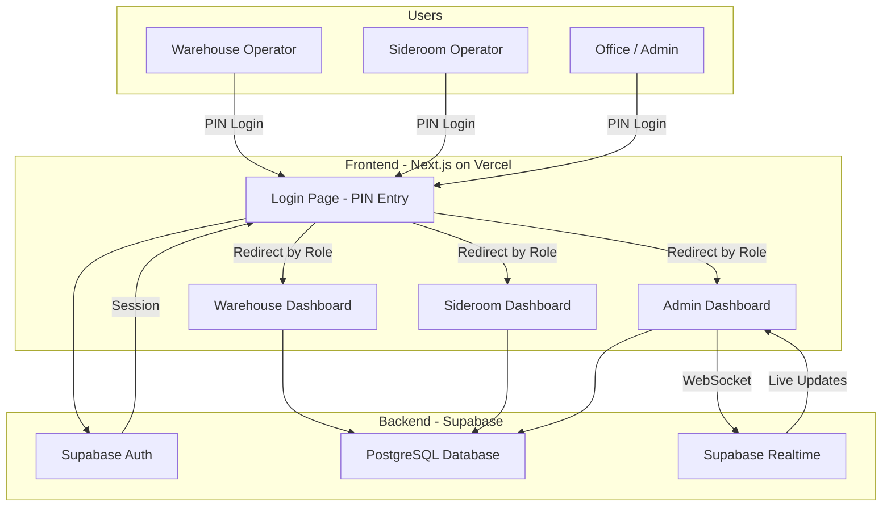
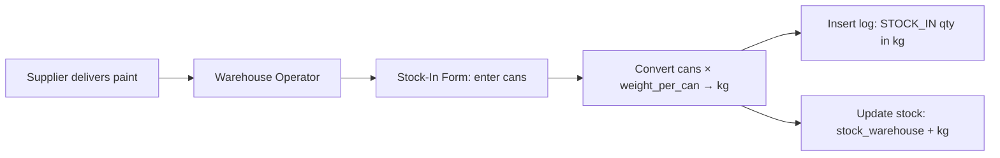
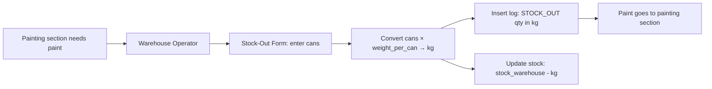
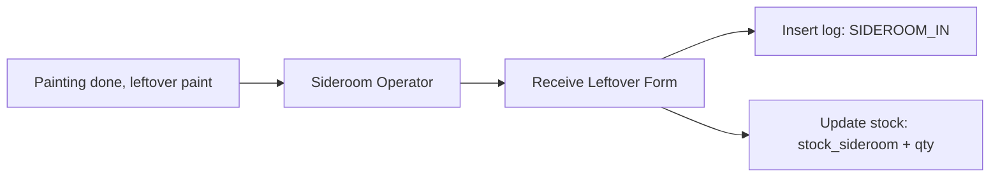
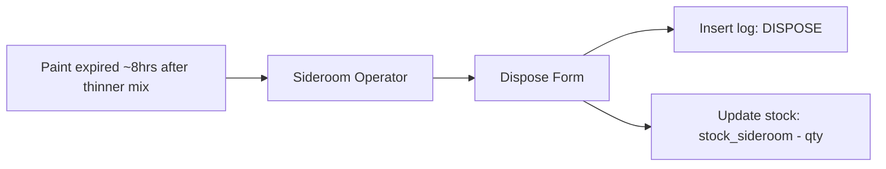

# System Architecture

## Overview

A web-based paint stock management system for a factory. The system digitizes the manual stock card process and provides real-time monitoring for the office.

## Tech Stack

| Layer | Technology |
|-------|-----------|
| Frontend | Next.js 14 (App Router), TypeScript |
| UI | Tailwind CSS, shadcn/ui |
| Charts | Recharts |
| Backend | Supabase (PostgreSQL, Auth, Realtime) |
| Deployment | Vercel (frontend), Supabase (backend) |

## System Architecture Diagram



## Data Flow

> All stock is tracked in **kg**. On stock-in/out the operator enters cans; the
> app converts to kg via `paint_items.weight_per_can` before writing `log.qty`
> and `stock_warehouse`.

### Stock-In (New Paint Arrives)



### Stock-Out (Paint to Painting)



### Sideroom-In (Leftover Paint)



### Dispose (Expired Paint)



## Authentication Flow

All users log in with a PIN (4-6 digits). No Supabase Auth - just a simple lookup:

1. User enters PIN on login page
2. Server looks up matching user in `users` table
3. If found, a JWT session cookie is created (signed with `jose`)
4. Middleware verifies the JWT cookie on every request
5. User is redirected to their role-specific dashboard:
   - `warehouse` -> `/warehouse`
   - `sideroom` -> `/sideroom`
   - `admin` -> `/dashboard`

## Route Protection

Next.js middleware (`src/middleware.ts`) protects these routes:

| Route | Access |
|-------|--------|
| `/login` | Public (redirects to dashboard if already logged in) |
| `/warehouse/**` | Authenticated users only |
| `/sideroom/**` | Authenticated users only |
| `/dashboard/**` | Authenticated users only |
| `/admin/**` | Authenticated users only |

## Folder Structure

```
project-stok-cat/
├── docs/                       # Documentation
│   ├── ARCHITECTURE.md         # This file
│   ├── DATABASE.md             # Database schema docs
│   ├── API.md                  # API documentation
│   └── DEPLOYMENT.md           # Deployment guide
├── src/
│   ├── app/                    # Next.js App Router
│   │   ├── login/              # PIN login page
│   │   ├── warehouse/          # Warehouse operator pages
│   │   ├── sideroom/           # Sideroom operator pages
│   │   ├── dashboard/          # Admin dashboard
│   │   │   └── _components/    # Dashboard-only presentational components
│   │   ├── admin/              # Admin management pages
│   │   │   ├── paint-items/    # Paint master data (+ _components/)
│   │   │   └── users/          # User management (+ _components/)
│   │   ├── layout.tsx          # Root layout
│   │   └── page.tsx            # Landing/redirect
│   ├── components/
│   │   ├── ui/                 # shadcn/ui components
│   │   └── shared/             # Shared custom components
│   ├── hooks/                  # Reusable client hooks
│   │   ├── use-dashboard-data.ts    # Dashboard fetch + Realtime subscription
│   │   ├── use-daily-usage.ts       # Chart date-range state + usage fetch
│   │   ├── use-dashboard-export.ts  # Dashboard CSV exports
│   │   ├── use-paint-items.ts       # Paint-item CRUD + search + export
│   │   ├── use-users.ts             # User CRUD + search + export
│   │   ├── use-transaction-form.ts  # Shared stock-in/out form logic
│   │   └── use-paginated-search.ts  # Filter + paginate helper
│   ├── lib/
│   │   ├── supabase/           # Supabase client helpers
│   │   │   ├── client.ts       # Browser client
│   │   │   ├── server.ts       # Server client
│   │   │   └── middleware.ts   # Middleware helper
│   │   ├── constants.ts        # App-wide constants
│   │   └── utils.ts            # Utility functions
│   ├── actions/                # Server actions
│   ├── types/
│   │   └── database.ts         # TypeScript DB types
│   └── middleware.ts           # Next.js middleware
├── supabase/
│   └── schema.sql              # Full database SQL
└── public/                     # Static assets
```

## Real-Time Updates

Supabase Realtime uses **WebSocket** to push database changes to the frontend instantly.

The subscription lives in the `useDashboardData` hook (`src/hooks/use-dashboard-data.ts`),
which the admin dashboard subscribes to:
- `log` table changes (new transactions appear immediately)
- `stock` table changes (stock levels update live)

To avoid hammering the server when several DB events arrive at once, the hook
debounces refetches by 300ms and exposes connection state (`connecting` /
`connected` / `disconnected`) for the live status badge.

```typescript
// Example subscription (see useDashboardData)
supabase
  .channel('dashboard-realtime')
  .on('postgres_changes', { event: '*', schema: 'public', table: 'stock' },
    () => debouncedFetch()
  )
  .on('postgres_changes', { event: 'INSERT', schema: 'public', table: 'log' },
    () => debouncedFetch()
  )
  .subscribe()
```

## Daily Usage Metrics (Bar Chart)

The admin dashboard shows 3 metrics per day (all in kg):

| Metric | Formula | Description |
|--------|---------|-------------|
| **Issued** | SUM(log.qty WHERE type = 'STOCK_OUT' AND date = today) | Paint sent to painting (kg) |
| **Consumed** | Issued - SUM(log.qty WHERE type = 'SIDEROOM_IN' AND date = today) | Paint actually used (kg) |
| **Wasted** | SUM(log.qty WHERE type = 'DISPOSE' AND date = today) | Paint thrown away (kg) |
