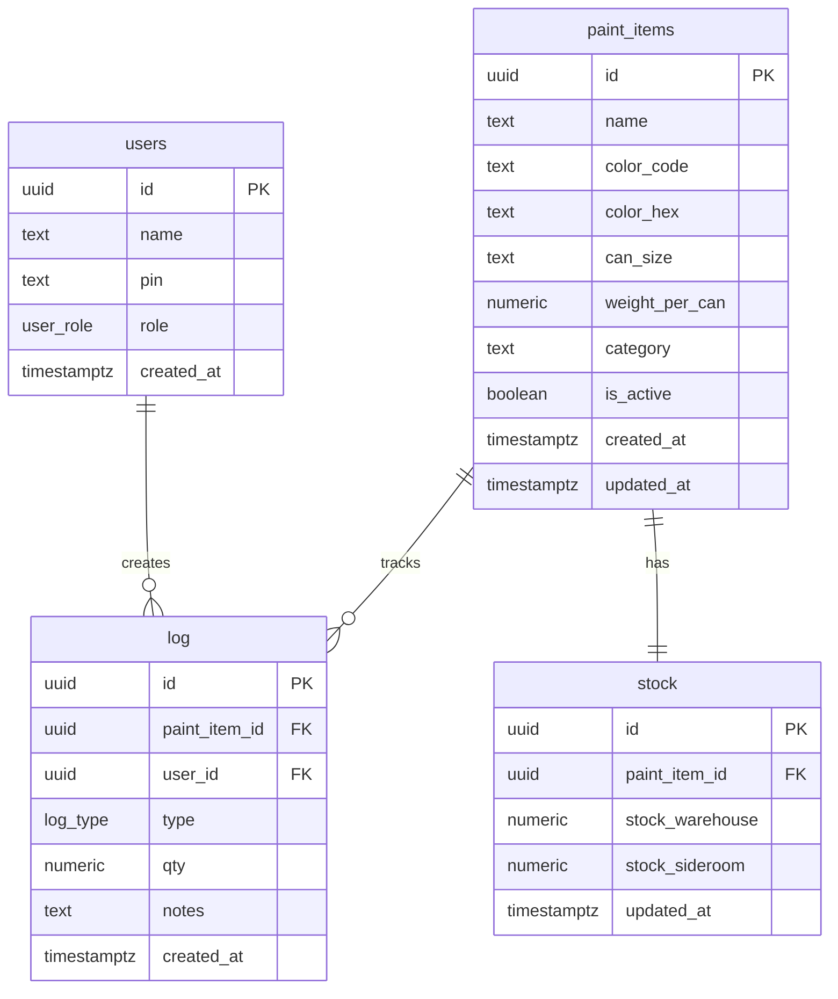

# Database Documentation

## Overview

The database uses PostgreSQL via Supabase. The schema is designed to track paint stock across two physical locations (warehouse and sideroom) and log every movement.

## ERD (Entity Relationship Diagram)

## Tables

### `users`

Standalone users table - no Supabase Auth dependency. PIN is the sole authentication method.

| Column | Type | Description |
|--------|------|-------------|
| `id` | UUID (PK) | Auto-generated UUID |
| `name` | TEXT | Display name of the user |
| `pin` | TEXT (UNIQUE) | 4-6 digit PIN for login |
| `role` | user_role ENUM | `warehouse`, `sideroom`, or `admin` |
| `created_at` | TIMESTAMPTZ | Account creation timestamp |

### `paint_items`

Master data for all paint types in the system.

| Column | Type | Description |
|--------|------|-------------|
| `id` | UUID (PK) | Auto-generated UUID |
| `name` | TEXT | Paint name (e.g., "Red Oxide") |
| `color_code` | TEXT | Internal color code (e.g., "R-001") |
| `color_hex` | TEXT | Hex color for UI display (e.g., "#CC0000") |
| `can_size` | TEXT | Can size (e.g., "1 Galon", "5 Liter") |
| `weight_per_can` | NUMERIC(10,2) | Weight of one can in kg; converts warehouse cans → kg |
| `category` | TEXT | Category (Base, Standard, Primer, Epoxy, Thinner, Coating) |
| `is_active` | BOOLEAN | Whether item is currently in use |
| `created_at` | TIMESTAMPTZ | Creation timestamp |
| `updated_at` | TIMESTAMPTZ | Last update timestamp |

### `stock`

Current stock levels per paint item, split by location.

| Column | Type | Description |
|--------|------|-------------|
| `id` | UUID (PK) | Auto-generated UUID |
| `paint_item_id` | UUID (FK) | References `paint_items(id)`, UNIQUE |
| `stock_warehouse` | NUMERIC(10,2) | Paint weight in the warehouse (kg) |
| `stock_sideroom` | NUMERIC(10,2) | Leftover paint weight in sideroom (kg) |
| `updated_at` | TIMESTAMPTZ | Last stock change timestamp |

**Total stock formula**: `stock_warehouse + stock_sideroom` (both in kg)

> All stock is tracked in **kilograms**. Warehouse operators enter the number of
> cans in the UI; the app multiplies by `paint_items.weight_per_can` and stores
> the resulting kg in `stock_warehouse` and `log.qty`.

### `log`

Activity log recording every stock movement.

| Column | Type | Description |
|--------|------|-------------|
| `id` | UUID (PK) | Auto-generated UUID |
| `paint_item_id` | UUID (FK) | References `paint_items(id)` |
| `user_id` | UUID (FK) | References `profiles(id)` |
| `type` | log_type ENUM | Transaction type (see below) |
| `qty` | NUMERIC(10,2) | Quantity in kg (must be > 0) |
| `notes` | TEXT | Optional notes (supplier, reason, etc.) |
| `created_at` | TIMESTAMPTZ | Transaction timestamp |

## Enums

### `log_type`

| Value | Meaning | Effect on Stock |
|-------|---------|-----------------|
| `STOCK_IN` | New paint arrives at warehouse | `stock_warehouse` increases |
| `STOCK_OUT` | Paint sent to painting section | `stock_warehouse` decreases |
| `SIDEROOM_IN` | Leftover paint goes to sideroom | `stock_sideroom` increases |
| `DISPOSE` | Paint thrown away (expired) | `stock_sideroom` decreases |

### `user_role`

| Value | Access |
|-------|--------|
| `warehouse` | Stock-in, Stock-out, view own history |
| `sideroom` | Receive leftover, Dispose paint |
| `admin` | Full access: dashboard, reports, manage master data |

## Triggers

| Trigger | Table | Action |
|---------|-------|--------|
| `paint_items_updated_at` | `paint_items` | Auto-updates `updated_at` on row update |
| `stock_updated_at` | `stock` | Auto-updates `updated_at` on row update |
| `auto_create_stock` | `paint_items` | Auto-creates `stock` row (0,0) on new paint item |
| `on_auth_user_created` | `auth.users` | Auto-creates `profiles` row on user signup |

## Row Level Security (RLS)

RLS is **disabled** on all tables. Access control is handled in the application layer:
- Next.js middleware (`src/middleware.ts`) protects routes via JWT session cookie
- Server actions verify session before performing operations

The Supabase anon key has full read/write access to all tables.

## Seed Data

10 sample paint items are included in the SQL schema covering categories: Base, Standard, Primer, Epoxy, Thinner, Coating.

## SQL File Location

Full schema SQL: `supabase/schema.sql`
