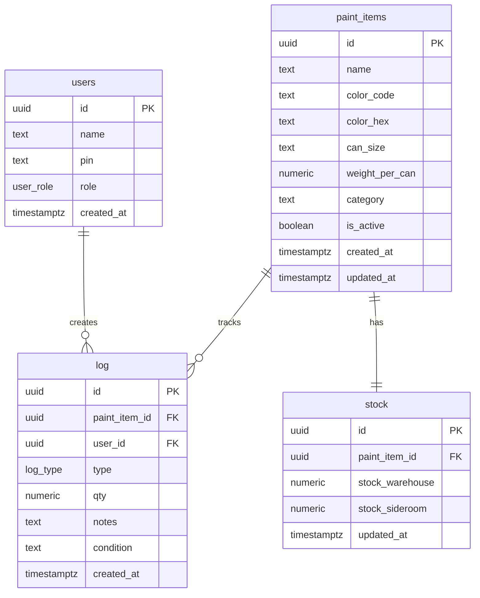

# Database Documentation

## Overview

The database uses PostgreSQL via Supabase. The schema is designed to track paint stock across two physical locations (warehouse and sideroom) and log every movement.

## ERD (Entity Relationship Diagram)

## Tables

### `users`

Standalone users table — no Supabase Auth dependency. PIN is the sole authentication method. PINs are hashed with bcrypt before storage; legacy plaintext PINs are auto-hashed on first successful login.

| Column | Type | Description |
|--------|------|-------------|
| `id` | UUID (PK) | Auto-generated UUID |
| `name` | TEXT | Display name of the user |
| `pin` | TEXT (UNIQUE) | 4-6 digit PIN (bcrypt-hashed) |
| `role` | user_role ENUM | `warehouse`, `sideroom`, `admin`, or `office` |
| `created_at` | TIMESTAMPTZ | Account creation timestamp |

### `paint_items`

Master data for all paint types in the system.

| Column | Type | Description |
|--------|------|-------------|
| `id` | UUID (PK) | Auto-generated UUID |
| `name` | TEXT | Paint name (e.g., "Red Oxide") |
| `color_code` | TEXT | Internal color code (e.g., "R-001") |
| `color_hex` | TEXT | Hex color for UI display (e.g., "#CC0000") |
| `can_size` | TEXT | Can size (e.g., "1 Galon", "5 Liter") |
| `weight_per_can` | NUMERIC(10,2) | Weight of one can in kg; converts warehouse cans → kg |
| `category` | TEXT | Category (Base, Standard, Primer, Epoxy, Thinner, Coating) |
| `is_active` | BOOLEAN | Whether item is currently in use |
| `created_at` | TIMESTAMPTZ | Creation timestamp |
| `updated_at` | TIMESTAMPTZ | Last update timestamp |

### `stock`

Current stock levels per paint item, split by location.

| Column | Type | Description |
|--------|------|-------------|
| `id` | UUID (PK) | Auto-generated UUID |
| `paint_item_id` | UUID (FK) | References `paint_items(id)`, UNIQUE |
| `stock_warehouse` | NUMERIC(10,2) | Paint weight in the warehouse (kg) |
| `stock_sideroom` | NUMERIC(10,2) | Leftover paint weight in sideroom (kg) |
| `updated_at` | TIMESTAMPTZ | Last stock change timestamp |

**Total stock formula**: `stock_warehouse + stock_sideroom` (both in kg)

> All stock is tracked in **kilograms**. Warehouse operators enter the number of
> cans in the UI; the app multiplies by `paint_items.weight_per_can` and stores
> the resulting kg in `stock_warehouse` and `log.qty`.

### `log`

Activity log recording every stock movement.

| Column | Type | Description |
|--------|------|-------------|
| `id` | UUID (PK) | Auto-generated UUID |
| `paint_item_id` | UUID (FK) | References `paint_items(id)` |
| `user_id` | UUID (FK) | References `users(id)` |
| `type` | log_type ENUM | Transaction type (see below) |
| `qty` | NUMERIC(10,2) | Quantity in kg (must be ≥ 0; 0 allowed for RESIDUAL_RETURN) |
| `notes` | TEXT | Optional notes (supplier, reason, etc.) |
| `condition` | TEXT | Optional paint condition (e.g., for dispose entries) |
| `created_at` | TIMESTAMPTZ | Transaction timestamp |

## Enums

### `log_type`

| Value | Meaning | Effect on Stock | Triggered By |
|-------|---------|-----------------|--------------|
| `STOCK_IN` | New paint arrives at warehouse | `stock_warehouse` increases | Warehouse operator |
| `STOCK_OUT` | Paint taken from warehouse to painting | `stock_warehouse` decreases, `stock_sideroom` increases; auto-logs `SIDEROOM_RECEIVE` | Sideroom operator |
| `RESIDUAL_RETURN` | Leftover paint returned after painting | `stock_sideroom` decreases by consumed portion; auto-logs `PAINT_CONSUMED` | Sideroom operator |
| `DISPOSE` | Paint thrown away (expired) | `stock_sideroom` decreases | Sideroom operator |
| `PAINT_CONSUMED` | *(auto-logged)* Paint consumed during painting | Informational only (stock already adjusted by `RESIDUAL_RETURN`) | System |
| `SIDEROOM_RECEIVE` | *(auto-logged)* Paint arrives at sideroom from `STOCK_OUT` | Informational only (stock already adjusted by `STOCK_OUT`) | System |

### `user_role`

| Value | Access |
|-------|--------|
| `warehouse` | Stock-in only |
| `sideroom` | Stock-out, Residual return, Dispose |
| `admin` | Full access: dashboard, reports, manage master data |
| `office` | Dashboard access for monitoring and reports (read-only) |

## Triggers

| Trigger | Table | Action |
|---------|-------|--------|
| `paint_items_updated_at` | `paint_items` | Auto-updates `updated_at` on row update |
| `stock_updated_at` | `stock` | Auto-updates `updated_at` on row update |
| `auto_create_stock` | `paint_items` | Auto-creates `stock` row (0,0) on new paint item |

## Row Level Security (RLS)

RLS is **enabled** on all tables. Access control is enforced via Supabase roles:

| Supabase Role | Access | Used By |
|---------------|--------|---------|
| `service_role` | Full access to all tables (bypasses RLS) | Server actions via `createAdminClient()` |
| `anon` | Read-only on `paint_items` and `stock` only | Browser client for dropdowns/stock display |

- The `users` table is fully protected — PINs are never exposed to the browser.
- The `log` table is protected — transaction history requires server-side access.
- Session management uses JWT cookies verified by server actions.
- Server actions verify the session before performing operations.

See migration `004_enable_rls.sql` for the full policy definitions.

## Indexes

| Index | Table | Column(s) |
|-------|-------|-----------|
| `idx_log_paint_item` | `log` | `paint_item_id` |
| `idx_log_type` | `log` | `type` |
| `idx_log_created_at` | `log` | `created_at` |
| `idx_log_user` | `log` | `user_id` |
| `idx_stock_paint_item` | `stock` | `paint_item_id` |
| `idx_paint_items_active` | `paint_items` | `is_active` |

## Seed Data

10 sample paint items are included in the SQL schema covering categories: Base, Standard, Primer, Epoxy, Thinner, Coating.

3 seed users are included:
- Admin: PIN `1234` (auto-hashed on first login)
- Warehouse Operator 1: PIN `1111` (auto-hashed on first login)
- Sideroom Operator 1: PIN `2222` (auto-hashed on first login)

## SQL File Location

Full schema SQL: `supabase/schema.sql`

Migrations: `supabase/migrations/`
